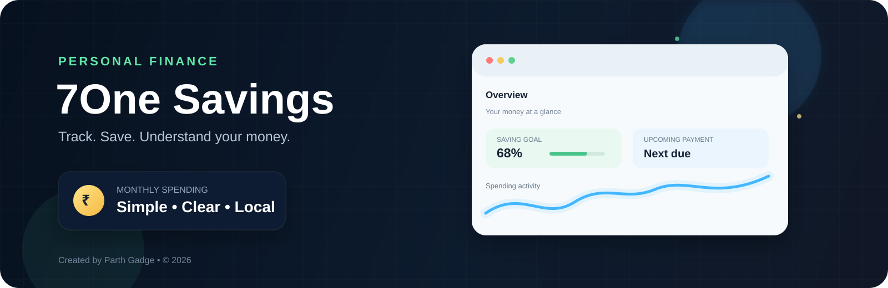
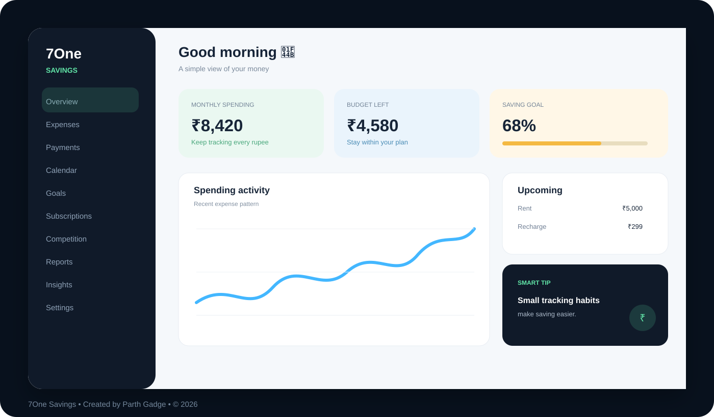

<div align="center">



# 💰 7One Savings

### A simple personal finance web app to help you **track, plan, save, and understand your money.**

<p>
  
  
  
  
</p>

**Created by Parth Gadge**

</div>

---

## 📌 What is 7One Savings?

**7One Savings** is a browser-based personal finance tracker.

Instead of using different apps for different tasks, this project puts everyday money-management tools in one place.

With 7One Savings, you can:

- 💸 Record your expenses
- 🔁 Remember recurring payments
- 📅 See payments on a calendar
- 🎯 Create saving goals
- 🏆 Run a saving competition
- 📱 Track subscriptions
- 📊 Understand spending
- 📄 Generate reports
- 💾 Backup and restore your data
- 🌙 Use light or dark mode

The current version works **directly in the browser** and stores its data locally.

---

## 🖼️ App Preview



---

# ⭐ Main Features

## 1. 📊 Dashboard

The dashboard gives you a quick overview of your money.

It can show:

- Monthly spending
- Remaining budget
- Upcoming payments
- Saving progress
- Recent expenses
- Saving tips
- Competition information

You don't have to open every section just to understand what is happening.

---

## 2. 💸 Expense Tracker

Record your daily spending and keep everything organized.

### You can save:

- Amount
- Date
- Description
- Category
- Paid by
- Optional note

### Categories include:

```text
Food
Travel
Shopping
Education
Bills
Health
Entertainment
Recharge
Mess
Other
```

You can also:

- Search expenses
- Filter by category
- Filter by month
- Delete an expense
- Export expenses as CSV

### Example

```text
Description: College Lunch
Amount: ₹120
Category: Food
Date: 03 Oct 2026
```

---

## 3. 🔁 Recurring Payments

Never forget regular payments.

You can create payments that repeat:

- Daily
- Weekly
- Monthly
- Yearly

Examples:

```text
Rent
Mess
Recharge
Subscription
Insurance
Fees
Other regular payments
```

The app calculates future occurrences automatically.

### Off-day adjustment

If a payment falls on a selected off-day/holiday, the application can calculate an adjusted date.

```text
Original date
      ↓
Is it an off-day?
      ↓
   Yes
      ↓
Adjusted payment date
```

The **actual date** remains available so you can understand when the payment was originally due.

---

## 4. 📅 Payment Calendar

The calendar gives you a visual view of your money-related dates.

It can show:

- Expenses
- Recurring payments
- Adjusted payment dates
- Today's date
- Overdue/exceeded items

You can move between months to understand what happened and what is coming next.

---

## 5. 🎯 Saving Goals

Create a target and track your progress.

For example:

```text
Goal: New Laptop

Target: ₹60,000
Saved:  ₹25,000

Progress:
████████░░░░ 41%
```

A goal can contain:

- Goal name
- Target amount
- Current saved amount
- Target date

This makes a large target easier to understand.

---

## 6. 🏆 Saving Competition

Want to make saving more fun?

Create a friendly competition between two people.

You can choose:

- Competition name
- Player 1
- Player 2
- Starting amount
- Start date
- Competition duration

Duration can be:

- Days
- Weeks
- Months

### How the winner is calculated

```text
Final Balance
=
Starting Amount − Total Spending
```

Example:

```text
Player A
Starting Amount: ₹10,000
Spent: ₹3,000
Final: ₹7,000

Player B
Starting Amount: ₹10,000
Spent: ₹4,200
Final: ₹5,800

🏆 Winner: Player A
```

---

## 7. 🔄 Subscription Tracker

Keep an eye on recurring subscriptions.

The application supports:

- Weekly subscriptions
- Monthly subscriptions
- Yearly subscriptions

It can calculate:

```text
Monthly subscription cost
+
Estimated yearly subscription cost
```

This makes it easier to understand how much recurring services are costing.

---

## 8. 📄 Reports

Choose a date range and generate a spending summary.

For example:

```text
From: 01 September
To:   30 September
```

The report can calculate:

- Total spending
- Number of transactions
- Average expense
- Category totals
- Detailed expense history

The application supports:

- PDF generation
- Print / Save as PDF
- Shareable report summary

---

## 9. 📈 Insights

The Insights section helps you understand your spending instead of simply listing numbers.

It can provide:

- Category breakdown
- Spending observations
- Money-health calculations
- Saving-oriented information

The goal is to answer a simple question:

> **"Where is my money going?"**

---

## 10. 🌙 Light & Dark Mode

Switch between light and dark themes according to your preference.

The interface is designed to remain readable and usable in both modes.

---

## 11. 💾 Backup & Restore

Your data is stored in the browser.

You can create a backup using JSON.

### Backup

```text
App data
   ↓
Download JSON
   ↓
Keep your backup safely
```

### Restore

```text
JSON backup
   ↓
Import into the app
   ↓
Restore your stored data
```

You can also clear all stored application data from Settings.

---

# 🔐 Where is my data stored?

The current version uses:

```text
Browser localStorage
```

That means your information is stored locally in your browser.

### Advantages

- No account required
- No backend required
- Works without a database
- Fast
- Simple

### Important

Your data is connected to the browser/device where you use the application.

If you clear the browser's site data, your stored information may be removed.

**Use the JSON backup feature if your data is important.**

---

# 🧩 How the application works

The application follows a simple flow:

```text
        USER
          │
          ▼
     ┌─────────┐
     │  UI     │
     └────┬────┘
          │
          ▼
   JavaScript Logic
          │
          ▼
   Calculations/Data
          │
          ▼
      localStorage
          │
          ▼
      Updated UI
```

For example, adding an expense follows this basic process:

```text
Enter expense
      ↓
Validate information
      ↓
Add expense to app state
      ↓
Save to localStorage
      ↓
Update dashboard
      ↓
Expense appears in list
```

---

# 🛠️ Technologies Used

| Technology | What it does |
|---|---|
| **HTML5** | Creates the application structure |
| **CSS3** | Handles design, layout, themes and responsiveness |
| **JavaScript** | Handles the application's functionality |
| **localStorage** | Saves user data in the browser |
| **jsPDF** | Creates PDF reports |
| **Google Fonts** | Provides the application's fonts |

### No complicated setup

The current application does **not** require:

- React
- Next.js
- Node.js
- MySQL
- Supabase
- Firebase
- A backend server
- A build process

It is a static browser application.

---

# 📁 Project Structure

```text
7One-Savings/
│
├── index.html
├── README.md
├── CODE-GUIDE.md
├── DESCRIPTION.txt
│
└── assets/
    ├── banner.svg
    ├── preview.svg
    │
    ├── css/
    │   └── style.css
    │
    └── js/
        └── app.js
```

### What are these files?

### `index.html`

The main webpage.

It contains the application's interface, sections, forms, navigation and dialogs.

### `assets/css/style.css`

Controls the visual appearance:

- Colors
- Layout
- Cards
- Buttons
- Forms
- Responsive design
- Dark mode
- Animations

### `assets/js/app.js`

Contains the application's functionality:

- Expenses
- Payments
- Calendar
- Goals
- Competitions
- Subscriptions
- Reports
- Insights
- Backup/import
- localStorage
- UI interactions

### `assets/banner.svg`

Animated GitHub README hero banner created specifically for **7One Savings**.

### `assets/preview.svg`

Animated visual preview of the application's dashboard.

### `CODE-GUIDE.md`

Technical notes about the codebase.

---

# ▶️ How to Run

## Method 1 — Open directly

You can simply open:

```text
index.html
```

in a modern browser.

---

## Method 2 — VS Code

1. Download or clone the project.
2. Open the folder in **VS Code**.
3. Open `index.html`.
4. Right-click the file.
5. Select **Open with Live Server**.

The application will open in your browser.

---

# 🌐 Deploy on GitHub Pages

Because the application is static, it can be deployed without a backend.

### Basic steps

```text
Create GitHub repository
        ↓
Upload project files
        ↓
Open Settings
        ↓
Pages
        ↓
Choose main branch
        ↓
Save
        ↓
GitHub generates your website
```

---

# ☁️ Deploy on Netlify

You can also deploy the project on Netlify.

The project does not require a server for its current functionality.

Upload the project folder and use the folder containing:

```text
index.html
assets/
```

as the site source.

---

# ⚠️ Current Limitations

This is important because the README describes the **current application**, not features that may be added later.

The current version does **not** include:

- Cloud database
- User accounts
- Login/signup
- Multi-device synchronization
- Server-side storage
- Guaranteed notifications when the website is closed
- Bank/UPI automatic transaction synchronization

The application currently stores data locally in the browser.

---

# 🔮 Future Possibilities

The project can later be expanded with features such as:

### 🔐 Accounts

- Login
- Registration
- User profiles

### ☁️ Cloud

- Supabase/Firebase database
- Multi-device synchronization
- Cloud backup

### 🔔 Notifications

- Email reminders
- Push notifications
- Payment reminders
- Goal reminders

### 🤖 Smart Finance

- Automatic expense categorization
- Spending predictions
- Smarter saving suggestions
- Receipt scanning

### 📊 Advanced Analytics

- Monthly charts
- Yearly comparisons
- Spending trends
- Category analysis

### 📱 Mobile

- PWA support
- Installable application
- Better mobile experience

> These are possible future improvements and are **not part of the current version**.

---

# 🎨 Design Philosophy

7One Savings follows a simple idea:

> **Personal finance should be easy enough to use every day.**

The interface focuses on:

- Simple navigation
- Clear numbers
- Useful information
- Quick actions
- Responsive design
- Light and dark themes
- Practical calculations
- Minimal complexity

---

# 👨‍💻 Creator

## Parth Gadge

**Creator & Developer — 7One Savings**

Built as a personal finance web application with HTML, CSS and JavaScript.

---

# 📜 Copyright

**© 2026 Parth Gadge. All Rights Reserved.**

7One Savings and its original application code, interface design, README documentation, custom SVG assets, visual presentation, and project-specific content are created by **Parth Gadge**, unless otherwise stated.

You may view the project for learning and evaluation purposes.

You may **not**:

- Claim the project as your own
- Re-publish the project as your original work
- Copy the complete application and redistribute it as your own
- Reuse the custom 7One Savings branding/assets commercially without permission

Third-party libraries, fonts, and services remain under their respective licenses.

### Third-party dependency

The application uses **jsPDF** for PDF generation. jsPDF is an independent open-source project and remains subject to its own license.

---

# 📌 Repository Description

Use this as the **GitHub repository description**:

> **7One Savings — a simple, interactive personal finance web app to track expenses, recurring payments, saving goals, subscriptions, reports, and saving competitions.**

### Suggested GitHub topics

```text
personal-finance
savings
expense-tracker
finance-app
budget-tracker
javascript
html
css
localstorage
money-management
student-project
web-app
7one-savings
```

---

# ⭐ Quick Overview

```text
                    7ONE SAVINGS
                         │
        ┌────────────────┼────────────────┐
        │                │                │
     TRACK             PLAN             SAVE
        │                │                │
    Expenses         Payments          Goals
    Categories       Calendar          Competition
    Spending         Subscriptions     Progress
        │                │                │
        └────────────────┼────────────────┘
                         │
                         ▼
                  UNDERSTAND MONEY
                         │
                  Reports + Insights
                         │
                         ▼
                     💰 7One
```

---

<div align="center">

### 💰 Track better. Save smarter. Understand your money.

**7One Savings**

**Created by Parth Gadge**

**© 2026 Parth Gadge — All Rights Reserved.**

</div>
